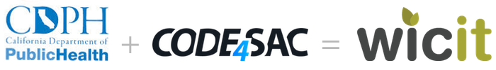
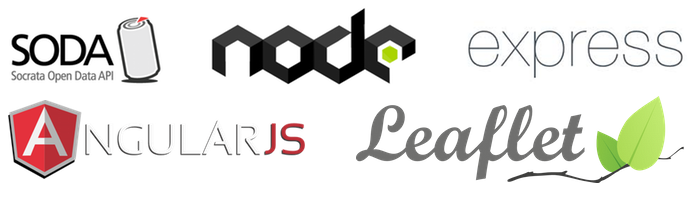
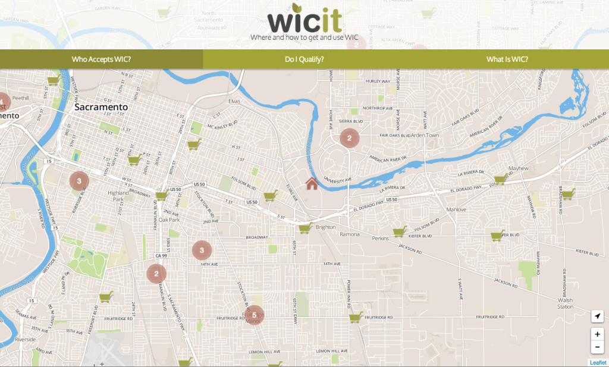

## The Collaboration

This summer, the [California Department of Public Health][1] (CDPH) teamed up with [Code for Sacramento][2] to help launch the new CDPH <a title="The CDPH Open Data Portal" href="https://health.data.ca.gov/" target="_blank">open data portal</a>. This collaboration ended up being a great experience for everyone involved, and led to the creation of a new civic web application called [WICit][3], that helps people more easily find stores that accept [WIC][4].

## [][5]

We thought it would be informative to run down the process of creating the application, and the factors that helped make the collaboration between a government agency and a Code for America brigade go so smoothly.

## The Data

CDPH gave us a  a sneak peek at the data sets that would be available, and the various formats and methods available for accessing those data sets. The data geeks among us were excited to see data on West Nile Virus cases, birth weights, and <a title="California WIC Home" href="http://www.cdph.ca.gov/programs/wicworks/Pages/default.aspx" target="_blank">WIC</a> vendors. The code geeks among us were excited to see GUI tools for playing with the data, multiple machine-readable formats like JSON and XML, and an easy-to-use API.

It was clear that CDPH had done their homework, and that this new data portal was going to be a really great tool for citizen scientists, civic hackers, and the general public. CDPH asked Code for Sacramento to come up with some applications, visualizations, or mashups using this new tool. Code for Sacramento members came up with a few ideas

  *  A <a title="Github repository for West Nile visualization." href="https://github.com/haileypate/viz-west_nile_virus" target="_blank">visualization of West Nile Virus Cases</a> over time, to help people easily see when it was most important to remove standing water, or use mosquito repellent.
  * A fun visualization of the booming popularity of baby names from the popular HBO series *Game of Thrones*.
  * An app to map the WIC vendor locations data set

The WIC locations data had been available for some time on the [official WIC site][6], but only as a large spreadsheet. This meant that WIC recipients who aren&#8217;t sure which stores in their neighborhood accept WIC have to search through ~1,000 rows of data to find their local stores. We realized that with the CDPH data portal, we could present these locations on a browsable map, allowing WIC recipients to more easily find stores that accept WIC, and more easily obtain nutritious food for their children. So we started building <a title="WICit" href="http://findwic.com" target="_blank">WICit</a>.

## The Code

The CDPH data portal&#8217;s API made getting the data we needed for WICit incredibly easy. The portal is built on the <a title="Socrata" href="http://www.socrata.com/" target="_blank">Socrata</a> platform, and uses Socrata&#8217;s <a title="Socrata's developer home." href="http://dev.socrata.com/" target="_blank">SODA API</a>. The SODA API provides HTTP endpoints corresponding to data sets, and accepts query parameters to filter items in a data set. These query parameters even allow helpful functions for doing things like retrieving location-based data within a set of geographical coordinates, like so:

<pre><a class="exec has-tooltip" style="color: #1b1b1b;" title="" href="https://data.cityofchicago.org/resource/alternative-fuel-locations.json?$where=within_box(location,%2041.885001,%20-87.645939,%2041.867011,%20-87.618516)">https://data.cityofchicago.org/resource/alternative-fuel-locations.json?$where=within_box(location, 41.885001, -87.645939, 41.867011, -87.618516)</a></pre>

If you <a title="Check out that sweet bounding box function!" href="https://data.cityofchicago.org/resource/alternative-fuel-locations.json?$where=within_box(location,%2041.885001,%20-87.645939,%2041.867011,%20-87.618516)" target="_blank">visit that URL</a>, you&#8217;ll get a listing of the alternative fuel locations in Chicago between the Kennedy Expressway and South Lake Shore Drive, all in an easy to use JSON format.  Pretty sweet, and perfect for a mapping application like WICit!

Knowing that we had such an easy to use data source, we started designing and coding the app. We built WICit for a <a title="node.js" href="http://nodejs.org" target="_blank">node.js</a> server, using the <a title="express.js" href="http://expressjs.com/" target="_blank">express</a> application framework. The node experience was pretty great, and it&#8217;s definitely something we&#8217;ll probably be using more at Code for Sacramento, if only because it makes it so much easier to bring new volunteers into a project. At Code for Sac, we have Ruby experts, Python masters, PHPers, Java professionals, and even the occasional .NET guru. One thing all of them have in common, is that they all know at least a little bit of Javascript. It&#8217;s also nice for our less-experienced developers to only have to worry about one syntax when they&#8217;re starting out.

On the client side, WICit uses the <a title="Angular" href="https://angularjs.org/" target="_blank">Angular framework</a>. The functionality of Angular is great (especially its data binding), but the design patterns it encourages, like dependency injection and separation of logic and presentation, are especially valuable for a team like ours. The availability of pre-existing Angular directives was also a big plus. WICit makes heavy use of the <a title="Angular Leaflet Directive" href="https://github.com/tombatossals/angular-leaflet-directive" target="_blank">angular-leaflet-directive</a> library, which is a really easy to use Angular directive for the incredible <a title="Leaflet.js" href="http://leafletjs.com/" target="_blank">Leaflet</a> library. As a bonus, we were able to contribute a couple of minor improvements to the angular-leaflet-directive project. It felt great to be able to use *and* contribute to an awesome open source project.<figure id="attachment_734" style="width: 700px;" class="wp-caption aligncenter">

[][7]<figcaption class="wp-caption-text">WICit is powered by an assortment of third-party tech.</figcaption></figure> 

Once we had the app running smoothly on a local development environment, it was time to move it to a public server. We chose [Amazon Web Services][8]&#8216; (AWS) Elastic Beanstalk tool to deploy WICit. AWS is an amazing set of services, and incredibly powerful. AWS is also a serious ally for civic tech organizations, and they&#8217;ve been super generous in offering credits to organizations like Code for Sacramento, to help us with our server needs. Getting WICit working on Elastic Beanstalk took a little bit of trial and error, but now the app is running on an fully scalable, zero downtime, no maintenance server architecture that we can deploy to with a single terminal command. Awesome.<figure id="attachment_736" style="width: 604px;" class="wp-caption alignnone">

[][9]<figcaption class="wp-caption-text">The finished WICit app.</figcaption></figure> 

## The Takeaways

A lot of people want to know how government and tech can work together, and we think the development of WICit is a pretty perfect example. There are a few key things that CDPH did to get our group excited about the project:

  1. **Show us the data. **CDPH came to Code for Sacramento with some really interesting data sets. Just as importantly, they made their data available in structured machine-readable formats, through a really clean API. There&#8217;s not much that programmers love more than a well designed API.
  2. **Know your needs, know your nerds. **Code for America brigades have access to talented technologists who want to use their skills to improve relationships between citizens and their government. Open data is the lifeblood of those efforts. When CDPH asked us to help demonstrate the value of their *open data* portal, they were speaking our language. When reaching out to a Code for America brigade, or any civic group, make sure your needs line up with their mission.
  3. **Stay engaged. **CDPH hosted the soft launch of their data portal at our meeting space ([Hacker Lab][10]). They brought directors, commissioners, analysts and scientists to discuss possible applications of their data. They invited us to the public launch, and showcased the work we&#8217;d done. CDPH Communications Director [Tamara Srzentic][11] came to Code for Sacramento meetings, and was tireless in fielding questions about the data portal, and encouraging our efforts. We have a lot of projects going at any given time, and if you want *your* project to get attention, you need to show up and remind people what it is and why it matters.

Collaborating with CDPH was a great experience. In the end, we not only demonstrated the power of the CDPH open data portal, but we created a tool that can hopefully help ordinary people more easily interact with their government. This is what we love to do, and we&#8217;re always looking for new partners! If you&#8217;re interested in working with Code for Sacramento to help use technology to improve the government user experience, [drop us a line][12], or follow us on [twitter][13]!

 [1]: http://www.cdph.ca.gov/Pages/DEFAULT.aspx "CDPH"
 [2]: http://code4sac.org "Code for Sacramento"
 [3]: http://findwic.com "WICit"
 [4]: http://www.fns.usda.gov/wic/women-infants-and-children-wic "WIC"
 [5]: ../images/posts/cdphplusc4s2.png
 [6]: http://www.cdph.ca.gov/programs/wicworks/Pages/default.aspx "Official California WIC Site"
 [7]: ../images/posts/logos.png
 [8]: http://aws.amazon.com "AWS"
 [9]: ../images/posts/finishedapp.png
 [10]: http://hackerlab.org/ "Sacramento Hacker Lab"
 [11]: http://twitter.com/TamaraIDEJA "@TamaraIDEJA"
 [12]: mailto:hello@codeforsacramento.org "Drop us a line!"
 [13]: http://twitter.com/cod4sac "@code4sac"