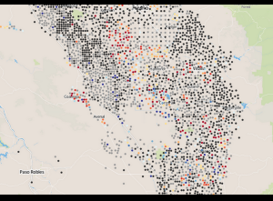

As we move into the fourth year of drought, water has become California&#8217;s hottest topic: cities ration water supplies ([and some areas have run out entirely][1]) and farmers drill deep into the earth to save their fields and orchards. The state passed both a $7.1 billion water bond and California&#8217;s[ first groundwater management package.][2]

But there&#8217;s not a whole lot of easily accessible, clean information out there: a one-stop water shop to parch our curiosity, especially when it comes to wells and groundwater.

So Code 4 Sac has been working on a groundwater project with Laci (lah-tsi) Videmsky (@videmsky) of the [New California Water Atlas][3] (NCWA), a grant-funded initiative to centralize smart, interactive water data. It&#8217;s based of the original California Water Atlas, a massive tome published in 1979 when, yes, Gerry Brown was governor for the first time and the state had just emerged from the &#8217;76-&#8217;77 drought. Take a minute to check it out.

\*1, 2, 3&#8230; 60 seconds later\*

Pretty amazing, eh?

CA&#8217;s Department of Water Resources has a lot of data gathered from wells over the year &#8211; location, historical surface-to-water values, etc. We wanted to take that data and make it useful: how have the wells in your county or water basin fared over time? Has this drought impacted your city or farm&#8217;s ability to get water, and are others near you suffering the as well?

But the DWR site proved extremely hard to scrape and, as it turns out, is a woefully incomplete package (more on that later). Fortunately, Laci already had the history of about some 32,000 wells on hand &#8212; he&#8217;d received a dump from the department, after running up against the same problems we did.

We brainstormed a bit on initial design, but quickly realized that the surface-to-water levels for every single well wasn&#8217;t actually that helpful &#8212; wells fluctuate significantly by season (high during the wet months, low during dry months). We needed trends: is the water level increasing on average, or decreasing?

Laci worked a trade out with his wife: linear regression of the well data for some rasterization of crop images. Now we&#8217;ve got gold** to work with.

** Maybe fools gold: turns out, even though it&#8217;s mandated, there are a whole lot of wells dug that never get reported.

Nevertheless, it&#8217;s much more than we had to start with. Laci drove up from Berkeley on Wednesday (after teaching a 4(!) hour class, bravo!) and met with us to brainstorm the second iteration of the well data.

He&#8217;d already found some interesting (read: sad) information: Only about 13.5% of the wells &#8212; ~5,000/~37,000  &#8211; had enough data to qualify (more than 4 years of records). Many of the ones that didn&#8217;t qualify had no historical readings whatsoever. Here&#8217;s a teaser (grey + black mean insufficient data)

[][4]

But information is information, and we&#8217;ve decided on a couple of goals to shoot for: be able to select well based on type (data/no data + declining/inclining water levels) and location (county/water basin).

We&#8217;re really excited to get this project off the ground (and into the cloud, haha, okay). Volunteer superstar Kari Mah (@kari_mah) has pledged her skills, and we&#8217;d love for you to join us too.

 [1]: http://www.nytimes.com/2014/10/03/us/california-drought-tulare-county.html?_r=0
 [2]: http://www.sacbee.com/2014/09/16/6711717/video-jerry-brown-signs-groundwater.html
 [3]: http://ca.statewater.org/
 [4]: ../images/posts/Screen-Shot-2014-10-04-at-10.35.51-AM.png