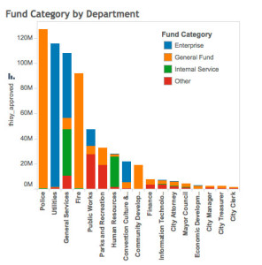
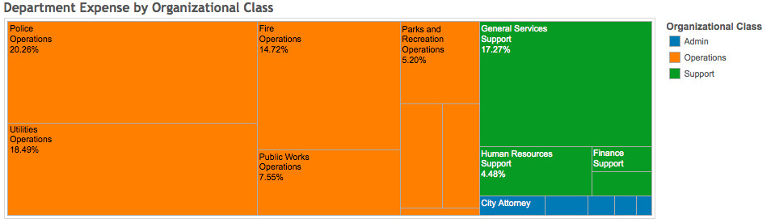

A few months ago, the Sacramento Open Budget Project snagged Sacramento’s 200-page budget and unlocked the city’s vitals from PDF purgatory.

We published the information <a href="https://github.com/code4sac/open-budget" target="_blank">here</a> in .csv format so that anyone could download and play with it. Code4Sac members created some really neat visualizations to show expenditures by department and funding source. We hoped to show the city and its citizens the power of opening up Sacramento’s data.

Now we’re thrilled to announce that the city has joined us in opening up its data, uploading <a href="http://data.cityofsacramento.org/datastreams/88104/city-of-sacramento-last-three-approved-budgets/" target="_blank">the last three years of budget history</a> online.

This is a great first step, and we look forward to future additions to the dataset. Other information we would like to see:

  * Budgets for individual divisions within big city departments
  * Expenditures for previous years (so we can compare them to the budget estimates)
  * Revenues
  * Capital Budgets
  * Historical data
  * Improved search capabilities
  * Other &#8211; add your suggestions in the comment section!

Ultimately, we would love to see all the data from the PDF version of the budget available as open data.

For a quick run-down of Code4Sac’s Open Budget Project, read on!

### **The Visualizations**

The data we analyzed comes from the  [2012-13 City of Sacramento Approved Budget][2]. To demonstrate the type of analysis you can do with freely available data, we’ve whipped up some initial visualizations, showing expenditures by fund, department, purpose, and staffing levels.

We’ve attached a few static examples to this blog post, but you should check out the [interactive Tableau version.][1]

### **The Data and the Process**

The data underlying the visualizations above is freely available in a <a href="https://github.com/code4sac/open-budget" target="_blank">GitHub repository</a>.  The data is collected in a set of CSV files, which you can easily read using any numerical analysis program (spreadsheet, database, statistical software, etc.).  We created these files by extracting the data out of the PDF document, cleaning it, exporting it into CSV files, reading it into a database, and cleaning it some more.  This was a long and arduous process.

### **The Future**

The purpose of this project was to demonstrate the public value of open budget data.  It was necessarily limited to a subset of older City of Sacramento budget data, and involved a time-intensive process to convert the data from a static form to a machine-readable one.  The City has taken the first step toward publishing its budget data directly in an open format, and we hope it will continue to work toward opening its entire budget document.  A full posting of the City’s budget data would be hugely beneficial, allowing the public a more thorough understanding of its city’s priorities and more opportunity to create interesting and useful applications on top of the data.

 [1]: http://public.tableausoftware.com/views/SacramentoCityBudget2012-2013/FundingSources
 [2]: http://portal.cityofsacramento.org/Finance/Budget/Documents/2012-13Budget
